# 19110122, Phạm Quốc Thái

# Lab 1: Buffer Overflow

## Task 1: Stack smashing by memory overwritten

## 1.1. bof1.c

First, I installed the program bof1.c into nano.

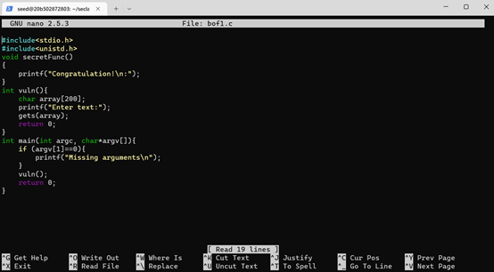

Then I run the command line _"gcc -g bof1.c -o bof1.out -fno-stack-protector -mpreferred-stack-boundary=2"_ to compile the program and as shown in the picture there is no error.

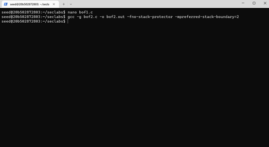

In order for the program to print the result _"code flow has been modified"_ we must find the address of the _"change"_ function, so I go to gdb and use the _"disas change" _ command to find the address of the function.

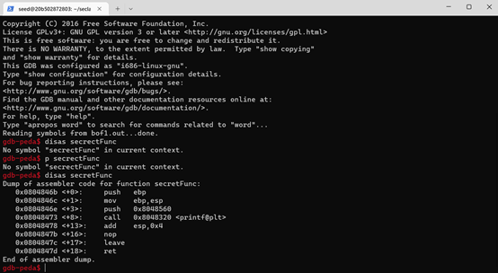

We see the function _"secretFunc"_ has the address 0x0804846b.

Then I exited gdb and entered the command _"python -c print 'a'\*204 + \x6b\x84\x04\x08'" | ./bof1.out"_ to see the output of the program.

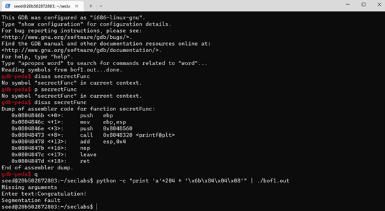

Command explanation:

- " python -c "print 'a'\*204 : In this statement I assign the buffer memory area with a value consisting of 204 letters 'a'.
- "+'\x6b\x84\x04\x08'" : In this statement, I add the address of the change function but write the opposite because in the memory area, the low byte is first, the high byte is after. (So '6b' is the lowest byte that should come first, followed in turn '84', '04', '08').

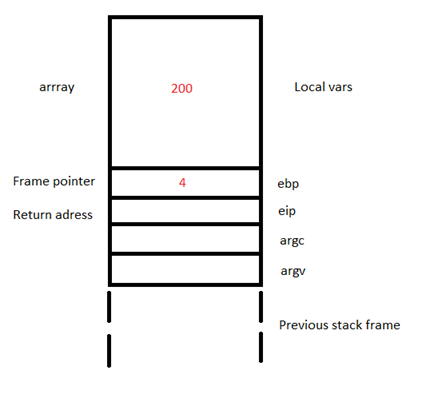

Explanation of printing 204 characters a: Because the Buffer occupies 200 memory cells in the memory area + 4 memory cells of the frame pointer.

We observe the results:

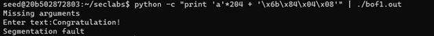

## 1.2. bof2.c

First, I installed the program bof2.c into nano.

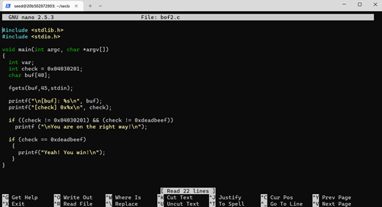

Then I run the command line _"gcc -g bof2.c -o bof2.out -fno-stack-protector -mpreferred-stack-boundary=2"_ to compile the program.

In this article the result can have 2 cases:

- Case 1: You are on right way!

In order for the program to print the result _"You are on right way!"_, I genarate a buffer overflow supported by fgets with 40byte and 4 random bytes.

I entered the command _"python -c print 'a'\*40 + \x23\x06\x01\x20'" | ./bof2.out"_.

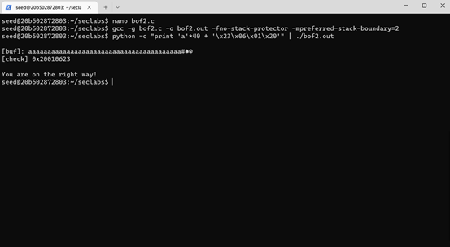

With \x23\x06\x01\x20 is random value.

Command explanation:

- " python -c "print 'a'\*40 : In this statement I assign the buffer memory area with a value consisting of 40 letters 'a'.
- "+'\x23\x06\x01\x20'" : In this statement, I added random bytes to change the value of the check variable, thus satisfying the condition of the first if line.

We observe the results:

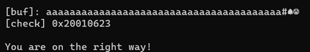

- Case 2: Yeah! You win!

In order for the program to print the result _"Yeah!You win!"_, I genarate a buffer overflow supported by fgets with 40byte and 4 bytes with pattern "deadbeef".

I entered the command "python -c print 'a'\*40 + \xef\xbe\xad\xde'" | ./bof2.out".

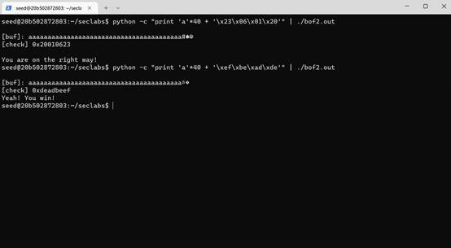

Command explanation:

- " python -c "print 'a'\*40 : In this statement I assign the buffer memory area with a value consisting of 40 letters 'a'.
- "+'\xef\xbe\xad\xde'" : In this statement, I added 4 bytes with patter "deadbeef" to change the value of the check variable, however in the memory area, the low byte is first, the high byte is after. (So 'ef' is the lowest byte that should come first, followed in turn 'be', 'ad', 'de').

We observe the results:

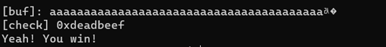

## 1.3. bof3.c

First, I installed the program bof3.c into nano.

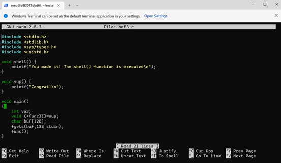

Then I run the command line _"gcc -g bof3.c -o bof3.out -fno-stack-protector -mpreferred-stack-boundary=2"_ to compile the program.

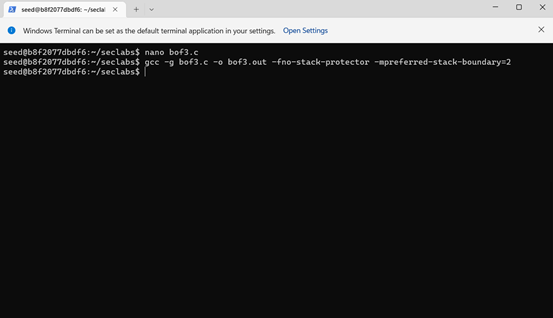

In order for the program to print the result _"Congrat"_, we must find the address of the _"sup"_ function, so I go to gdb and use the _"disas sup"_ command to find the address of the function.

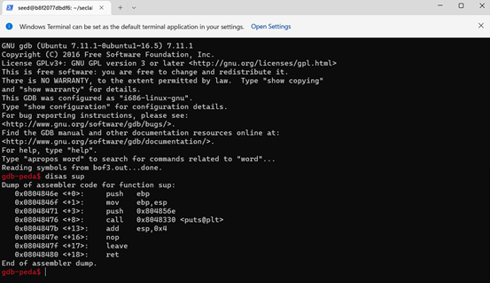

We see the function _"change"_ has the address 0x0804846e.

Then I exited gdb and entered the command _"./bof3.out $(python -c "print('a'\*136+'\x6e\x84\x04\x08')")"_ to see the output of the program.

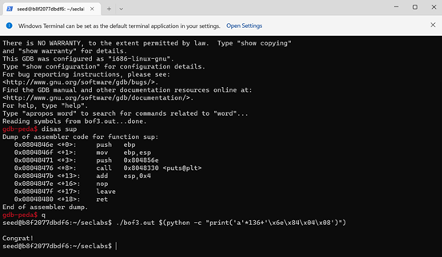

Command explanation:

- " $(python -c "print('a'\*136 " : In this statement I assign the buffer memory area with a value consisting of 136 letters 'a'.
- "+'\x6e\x84\x04\x08'" : In this statement, I add the address of the change function but write the opposite because in the memory area, the low byte is first, the high byte is after. (So '6e' is the lowest byte that should come first, followed in turn '84', '04', '08').

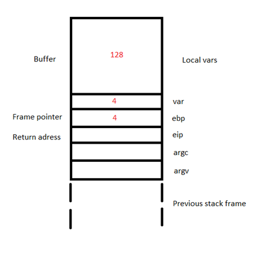

Explanation of printing 136 characters a: Because the Buf occupies 128 memory cells in the memory area + 4 memory cells of the var variable + 4 memory cells of the frame pointer.

We observe the results:

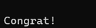
